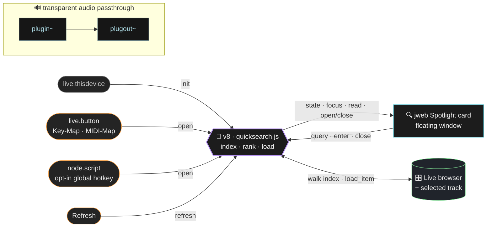

<div align="center">

# 🔍 M4L QuickSearch

### Spotlight for your Ableton Live device rack.

Hit a hotkey → a search card opens centered over Live → start typing → your instruments, effects & plug‑ins fuzzy‑match instantly → press <kbd>↵</kbd> and it lands on the selected track.


</div>

---

## ✨ What it does

- ⚡️ **Instant fuzzy search** — type `ppd` → *Ping Pong Delay*, `proq` → *FabFilter Pro‑Q 3*. Spotlight‑style ranking (exact › prefix › word‑boundary › subsequence).
- 🎹 **Devices + plug‑ins** — instruments, audio effects, MIDI effects, and your VST/AU plug‑ins, all in one index.
- 🎯 **Lands on the selected track** — press <kbd>↵</kbd> and the device drops onto whatever track you have selected.
- 🚦 **Smart compatibility hint** — try to drop an instrument on an audio track and you get a gentle inline nudge instead of silence.
- 🎨 **Looks like Live** — built to the real Live 12 dark palette (amber caret, cyan selection), smooth open/close, category‑tinted icons.
- ⌨️ **Your hotkey** — map any key via Live's Key‑Map (or a MIDI pad), with an **opt‑in OS‑global hotkey** for power users.

---

## 🚀 Quick start

> **Requirements:** Ableton Live **12.2+** with Max **9+** (uses the `v8` engine + modern `jweb`). macOS primary; the global‑hotkey extra also targets Windows.

```bash
npm install      # 📦 esbuild + typescript
npm run build    # 🔨 src → dist/quicksearch.js, builds the device + UI
npm test         # ✅ unit tests (search / compatibility / bridge)
```

Then, in Max/Live:

1. 🗂️ **Max → Options → File Preferences → Search Path** — add this repo's **`dist/`** and **`html/`** folders.
2. 🎛️ Drag **`QuickSearch Dev.amxd`** onto your **Master** track (or any track).
3. 🖥️ Open the Max console — you should see `QuickSearch: indexed N items`.
4. ⌨️ **Map the hotkey:** enter **Key Map** mode (<kbd>⌘K</kbd>), click the device's **trigger button**, press your key (a function key or backtick works great — single keys only), exit Key Map mode.
5. 🎉 Press your key anywhere in Live → the overlay opens. Type, <kbd>↑</kbd><kbd>↓</kbd> to move, <kbd>↵</kbd> to load, <kbd>esc</kbd> to close.

> 🎚️ **Prefer a controller?** Use **MIDI Map** mode on the same button to trigger from a hardware pad.

---

## 🧠 How it works



> *Bridge: v8 ⇄ jweb over device‑scoped sends (`---qs_ui` / `---qs_from_ui`); the floating window is shown/hidden by `pcontrol`. Triggers, the browser walk, and `load_item` all funnel through the single v8 brain.*

- 📇 The **v8** brain walks Live's browser (`live_app browser`) once on load, building an in‑memory index of every loadable device/plug‑in (deduped by `uri`, kind tagged by category). The walk is chunked across scheduler ticks so Live never stalls.
- 🖼️ The **jweb** page is the UI. It talks to v8 over the `window.max` bridge; state is shipped as base64‑JSON (one Max atom — no escaping headaches).
- 📦 Loading uses `browser.load_item`, which targets `live_set view selected_track`. Since `load_item` silently no‑ops on an incompatible drop, compatibility is **predicted before** loading and the hint is shown instead.
- 🅰️ The device is an **Audio Effect**, so it can live on any track — park one instance on the **Master** and it always targets whatever track you've selected.

| Item kind | Loads onto… |
|---|---|
| 🎛️ Audio effect | any track ✅ |
| 🎹 Instrument | MIDI tracks only |
| 🎵 MIDI effect | MIDI tracks only |
| 🔌 Plug‑in (VST/AU) | never blocked (Live decides) |

---

## 🎨 Preview the overlay in a browser

The Spotlight card is a self‑contained web page, so you can see and iterate on it **without launching Ableton**:

```bash
npm run preview        # builds dist/ui.preview.html and opens it in your browser
# or: npm run build, then open dist/ui.preview.html in any browser
```

With no Max bridge present, `html/ui.js` falls back to **design‑preview mode** and renders sample devices — type to watch the fuzzy filter and selection highlight. This is exactly the page that was shared as the Spotlight‑overlay preview. To publish your own, host `dist/ui.preview.html` on any static host (e.g. **GitHub Pages**), drop it into a hosted HTML viewer, or just screenshot it.

### 🔁 Live‑reload while you edit

For iterating on the look, run the dev server — it serves `html/` and **reloads the browser on every save**:

```bash
npm run dev            # → http://localhost:5173 (opens automatically)
PORT=4000 npm run dev  # custom port
```

Edit `html/index.html`, `styles.css`, or `ui.js` and the change appears instantly — no rebuild, no manual refresh. The server injects the dark backdrop + a live‑reload client for you, and (zero dependencies) is just Node's `http` + `fs.watch` + Server‑Sent Events.

> 🎛️ This previews the **UI / design** only — there's no Max bridge in a browser, so it shows sample devices. The v8 brain, indexing, and real loading need Ableton + Max: build the device (`npm run build`) and run it in Live for those.

The build also emits two self‑contained pages under `dist/` (both git‑ignored — regenerated by every build):

| File | Body | Purpose |
|---|---|---|
| `dist/ui.preview.html` | dark “over‑Live” backdrop | 👀 eyeball / iterate the design in a browser |
| `dist/ui.bundle.html` | transparent | 🧊 seed for the frozen‑device `executejavascript` injection |

> ℹ️ The preview populates a second or so after load — the page first waits for a Max bridge, then falls back to mock data. The real device instead loads `html/index.html` live, driven by the v8 brain.

---

## ⌨️ Opt‑in OS‑global hotkey

<details>
<summary>The Key‑Map trigger only fires while <b>Live</b> is focused. Want a true system‑wide hotkey? Expand for setup.</summary>

<br>

1. 📥 Install the native dependency once — send the `node.script` object the message **`script npm install`** (pulls `uiohook-napi`).
2. 🔘 Flip the device's **Global Hotkey** toggle on.
3. 🔐 **macOS:** grant **Ableton Live** both **Accessibility** *and* **Input Monitoring** in System Settings → Privacy & Security, then toggle again. Default key is **F8**; change it by sending the `node.script` object `key f9` (etc.).

> ⚠️ This path uses an unsigned native module and an OS‑level key listener — keep it off unless you need it. The Node process has **no** Live API access; it only nudges the same `open` path the button uses.

</details>

---

## 🧊 Freezing for distribution

<details>
<summary>For personal use the dev device + search path is all you need. Expand to share it with others.</summary>

<br>

1. ❄️ In Max, **Freeze** the device (snowflake icon) and **Save As** `QuickSearch.amxd`.
2. 🔎 Verify assets were captured: **File → List Externals and Subpatcher Files**.
3. 💾 Commit the frozen `QuickSearch.amxd` for that release.

> 🧩 **jweb caveat:** a frozen `.amxd` can't read a bundled `.html` directly. `npm run build` produces `dist/ui.bundle.html` (a single self‑contained page) as the seed for the established *executejavascript injection* approach — wiring that injection is the remaining step for a fully self‑contained frozen build. Until then, distribute with `html/` on the recipient's search path.

🚫 Never unfreeze the distributed device to edit it — edit the `src/` + `html/` sources and rebuild.

</details>

---

## 🗂️ Repo layout

| Path | What |
|---|---|
| 🧠 `src/*.ts` | v8 brain: `quicksearch` (glue/bridge), `browser-index`, `track` (classify + compat), `search`, `fuzzy`, `loader`, `b64` |
| 🖼️ `html/` | the jweb Spotlight UI: `index.html`, `styles.css`, `ui.js` |
| ⌨️ `node/` | opt‑in global hotkey (`global-hotkey.js` + `package.json`) |
| 🔧 `tools/` | build pipeline: `build.mjs`, `patcher.mjs`, `amxd.mjs`, `bundle-ui.mjs`, `test.mjs` |
| 📐 `types/` | Max/LiveAPI ambient typings |
| 📄 `docs/PLAN.md` | the full design/implementation plan |
| 🎛️ `QuickSearch Dev.amxd` | generated dev device *(git‑ignored)* |
| ❄️ `QuickSearch.amxd` | frozen release artifact *(committed per release)* |

### 🛠️ Dev workflow

`npm run watch` rebuilds `dist/quicksearch.js` on every save. To reload it in the running device, send the `v8` object a **`compile`** message, or remove and re‑add the device. *(Auto‑watch is intentionally off — it leaks Live API observers across reloads.)*

---

## ✅ Verify‑in‑Max checklist

The pure logic, the `.amxd` container, and the patcher structure are validated automatically — `npm test`, `npm run typecheck`, and the build round‑trips the device through **Ableton's own `amxd_textconv.py` parser**. A few things can only be confirmed live; check these first:

1. 🎹 **jweb keyboard capture** *(the one real risk)* — confirm typing, **especially the spacebar**, stays in the search field and doesn't leak to Live's transport. The card uses `rendermode 2` (offscreen + transparent) to minimise this. If it leaks, swap the `<input>` for a native Max `textedit` (the logic/UI around it is unchanged).
2. 🪟 **Floating window flags** — the overlay's `thispatcher` message sets `float / notitle / nogrow / …` and `window size 360 220 1060 740`. Confirm it floats above Live; tweak the size/position numbers in the `p qs_overlay` subpatcher for your display.
3. 📦 **load_item id form** — the loader calls `browser.call("load_item", <id>)`, auto‑falls back to the two‑token `"id" N` form, and only reports success when the track's device count actually increased. Confirm a device lands on the selected track.

---

## 🔁 Version control (readable patcher diffs)

`.gitattributes` registers a `maxdiff` textconv. Enable it once:

```bash
git config diff.maxdiff.textconv "python3 /path/to/Ableton/maxdevtools/maxdiff/amxd_textconv.py"
```

Now `git diff` on `*.amxd` / `*.maxpat` shows the human‑readable patcher instead of binary. 🎉
