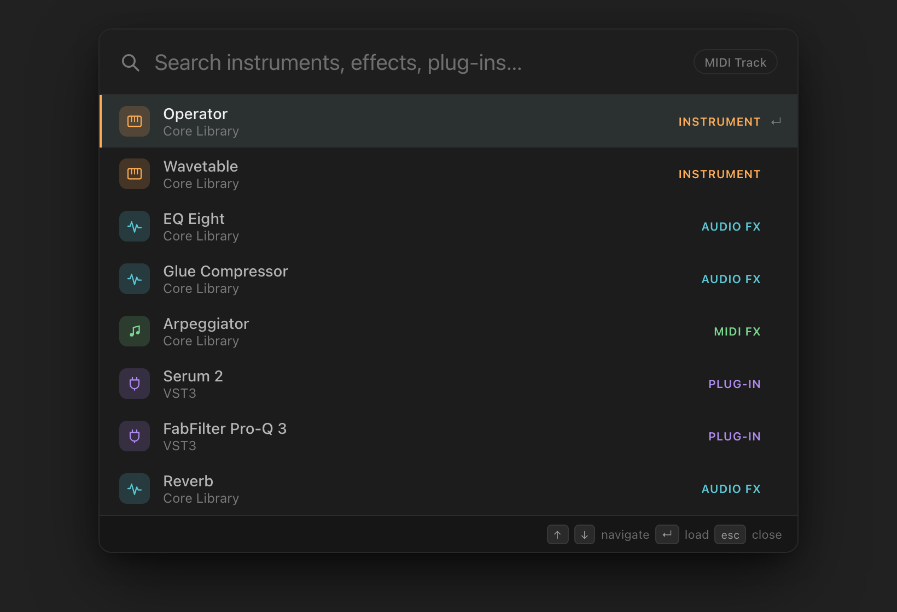
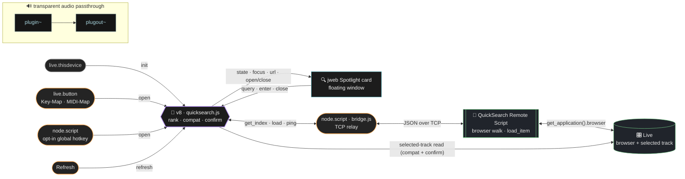

<div align="center">

# 🔍 M4L QuickSearch

### Spotlight for your Ableton Live device rack.

Hit a hotkey → a search card opens centered over Live → start typing → your instruments, effects & plug‑ins fuzzy‑match instantly → press <kbd>↵</kbd> and it lands on the selected track.




</div>

---

## ✨ What it does

- ⚡️ **Instant fuzzy search** — type `ppd` → *Ping Pong Delay*, `proq` → *FabFilter Pro‑Q 3*. Spotlight‑style ranking (exact › prefix › word‑boundary › subsequence).
- 🎹 **Devices + plug‑ins** — instruments, audio effects, MIDI effects, and your VST/AU plug‑ins, all in one index.
- 🎯 **Lands on the selected track** — press <kbd>↵</kbd> and the device drops onto whatever track you have selected.
- 🚦 **Smart compatibility hint** — try to drop an instrument on an audio track and you get a gentle inline nudge instead of silence.
- 🎨 **Looks like Live** — built to the real Live 12 dark palette (amber caret, cyan selection), smooth open/close, category‑tinted icons.
- ⌨️ **Your hotkey** — map any key via Live's Key‑Map (or a MIDI pad), with an **opt‑in OS‑global hotkey** for power users.

---

## 🚀 Quick start

> **Requirements:** Ableton Live **12.2+** with Max **9+** (uses the `v8` engine + modern `jweb`). macOS primary; the global‑hotkey extra also targets Windows.
>
> **One‑time setup:** the device reaches Live's browser through a small **Python Remote Script** (the browser isn't exposed to the Max LiveAPI). You install it once — [steps below](#set-it-up-in-ableton-live).

### 🎧 Just want to use it?

Grab the latest packaged build — no Node, no build step:

**➡️ [Download `QuickSearch.zip` from the latest release](https://github.com/JonasGrunau/m4l-quick-search/releases/latest)**

It contains everything the device needs: the `.amxd`, the `dist/` brain (with the overlay UI baked in), and the `remote-script/` browser bridge. Unzip it, then:

1. 🗂️ **Add the unzipped `dist/` folder** to **Max → Options → File Preferences → Search Path** (see the [no‑separate‑Max‑app note](#set-it-up-in-ableton-live) below if you can't find that window).
2. 🐍 **Install the Remote Script:** copy `remote-script/QuickSearch/` into Live's **Remote Scripts** user folder, then select **QuickSearch** under Live → Preferences → **Link, Tempo & MIDI** → Control Surface. ([details below](#set-it-up-in-ableton-live))
3. 🎛️ **Drag `dist/QuickSearch Dev.amxd` onto a track** (the **Master** track is ideal), then jump to [**Map the hotkey**](#set-it-up-in-ableton-live).

> `INSTALL.txt` inside the zip repeats these steps. 🛠️ Want to hack on it or preview the UI in a browser? Keep reading.

---

### 🧑‍💻 Build from source

```bash
npm install      # 📦 esbuild + typescript
npm run build    # 🔨 src → everything in dist/ (device + brain + UI bundle)
npm run dev      # 🔁 live‑reload UI preview in your browser (no Ableton needed)
npm test         # ✅ unit tests (search / compatibility / bridge)
```

`npm run build` writes everything to **`dist/`** — including **`dist/QuickSearch Dev.amxd`**, the device you'll drag into Live below.

### Set it up in Ableton Live

> 💡 **Heads-up — there is no separate “Max” app to open.** In Max for Live, the **Max editor opens *from inside Live*** when you click a device's edit button. So the menu path in step 3 lives in a window that doesn't exist yet — you create it by opening the device. Do the steps in order and it appears.

1. 🎛️ **Drag `dist/QuickSearch Dev.amxd` onto a track** — the **Master** track is ideal (one instance there always targets whichever track you've selected).
2. 🐍 **Install the browser Remote Script (one time).** Live's browser isn't reachable from the Max LiveAPI, so a tiny Python Remote Script does the enumerate/load:
   - Copy **`remote-script/QuickSearch/`** into Live's Remote Scripts **user** folder:
     - macOS: `~/Music/Ableton/User Library/Remote Scripts/`
     - Windows: `…\Documents\Ableton\User Library\Remote Scripts\`
   - In Live: **Preferences → Link, Tempo & MIDI**, set any **Control Surface** slot to **QuickSearch** (leave Input/Output to *None*). Live loads it now and on every launch.
3. ✎ **Open the Max editor.** On the device's title bar in Live, click the **edit button** — the **pencil ✎ icon** (older Live versions show a **wrench 🔧**). A separate **Max** application window opens. *This is the “Max” the next step refers to.*
4. 🗂️ **Point Max at this repo's `dist/` folder.** With that Max window focused, the macOS menu bar (top of screen) now reads **Max**. Go to **Options → File Preferences → Search Path** and add this repo's **`dist/`** folder, then close the editor.
   - `dist/` holds `quicksearch.js` (the v8 brain, with the overlay UI baked in); the device finds `node/` (the bridge) next to it. The Dev device loads the brain live from this path.
5. 🖥️ **Confirm it loaded.** Open the Max console (**Window → Max Console**) — you should see `QuickSearch: init (browser bridge)` then `QuickSearch: indexed N items` with **N > 0**. If the overlay reads *“Waiting for the QuickSearch Remote Script,”* re‑check step 2.
6. ⌨️ **Map the hotkey:** enter **Key Map** mode (<kbd>⌘K</kbd>), click the device's **trigger button**, press your key (a function key or backtick works great — single keys only), exit Key Map mode.
7. 🎉 **Use it:** press your key anywhere in Live → the overlay opens. Type, <kbd>↑</kbd><kbd>↓</kbd> to move, <kbd>↵</kbd> to load, <kbd>esc</kbd> to close.

> 🎚️ **Prefer a controller?** Use **MIDI Map** mode on the same button to trigger from a hardware pad.

---

## 🧠 How it works



> *Bridge: v8 ⇄ jweb over device‑scoped sends (`---qs_ui` / `---qs_from_ui`); the floating window is shown/hidden by `pcontrol`. The browser walk and `load_item` run in the Python Remote Script — v8 reaches it through `node.script bridge.js` over a localhost socket — while triggers, ranking, and compatibility funnel through the single v8 brain.*

- 📇 **Why a Remote Script?** Live's browser is **not exposed to the Max LiveAPI** — the `Application` object has no `browser` (confirmed against the Live 12 LOM; `live_app browser` throws *“component 'browser' is not an object”*). So enumeration + `load_item` live in a small **Python Remote Script** (`remote-script/QuickSearch/`). It walks `get_application().browser` (instruments / audio_effects / midi_effects / plugins) across main‑thread ticks — no threads, Live never stalls — deduping by `uri` and tagging kind by category, then ships an index of `{name, uri, source, kind}`.
- 🌉 **The bridge.** v8 (and Max) can't open sockets, so `node.script bridge.js` (Node for Max, stdlib `net` — no npm) relays between the v8 brain and the Remote Script over localhost TCP. The index crosses as base64 chunks; a load is a `load <uri>` round‑trip. While the script isn't running, the overlay shows a *“Waiting for the QuickSearch Remote Script”* setup hint instead of a blank list.
- 🖼️ The **jweb** page is the UI. It talks to v8 over the `window.max` bridge; state is shipped as base64‑JSON (one Max atom — no escaping headaches).
- 📦 **Loading** sends the chosen `uri` to the Remote Script, which calls `browser.load_item` (it targets `live_set view selected_track`). `load_item` silently no‑ops on an incompatible drop, so compatibility is **predicted before** loading, and success is confirmed by the selected track's **device‑count delta** — read via the LiveAPI, which *does* expose tracks/devices.
- 🅰️ The device is an **Audio Effect**, so it can live on any track — park one instance on the **Master** and it always targets whatever track you've selected.

| Item kind | Loads onto… |
|---|---|
| 🎛️ Audio effect | any track ✅ |
| 🎹 Instrument | MIDI tracks only |
| 🎵 MIDI effect | MIDI tracks only |
| 🔌 Plug‑in (VST/AU) | never blocked (Live decides) |

---

## 🎨 Preview the overlay in a browser

The Spotlight card is a self‑contained web page, so you can see and iterate on it **without launching Ableton**. Run the dev server — it serves `html/` and **reloads the browser on every save**:

```bash
npm run dev            # → http://localhost:5173 (opens automatically)
PORT=4000 npm run dev  # custom port
```

Edit `html/index.html`, `styles.css`, or `ui.js` and the change appears instantly — no rebuild, no manual refresh. The server injects a dark “over‑Live” backdrop + a live‑reload client for you, and (zero dependencies) is just Node's `http` + `fs.watch` + Server‑Sent Events. With no Max bridge present, `html/ui.js` falls back to **design‑preview mode** and renders sample devices — type to watch the fuzzy filter and selection highlight. To share a snapshot, just screenshot the browser tab.

> 🎛️ This previews the **UI / design** only — there's no Max bridge in a browser, so it shows sample devices. The v8 brain, indexing, and real loading need Ableton + Max: build the device (`npm run build`) and run it in Live for those.

> ℹ️ The page populates a second or so after load — it first waits for a Max bridge, then falls back to mock data. (The real device instead embeds this page in the v8 brain at build time and hands it to jweb as a self‑contained `data:` URL — see [Distribution](#-distribution).)

---

## ⌨️ Opt‑in OS‑global hotkey

<details>
<summary>The Key‑Map trigger only fires while <b>Live</b> is focused. Want a true system‑wide hotkey? Expand for setup.</summary>

<br>

1. 📥 Install the native dependency once — send the **global‑hotkey** `node.script` object (the one reading `global-hotkey.js`, *not* the always‑on `bridge.js`) the message **`script npm install`** (pulls `uiohook-napi`).
2. 🔘 Flip the device's **Global Hotkey** toggle on.
3. 🔐 **macOS:** grant **Ableton Live** both **Accessibility** *and* **Input Monitoring** in System Settings → Privacy & Security, then toggle again. Default key is **F8**; change it by sending the `node.script` object `key f9` (etc.).

> ⚠️ This path uses an unsigned native module and an OS‑level key listener — keep it off unless you need it. The Node process has **no** Live API access; it only nudges the same `show` path the button uses.

</details>

---

## 📦 Distribution

<details>
<summary>For personal use the dev device + search path is all you need. Expand for how releases are packaged.</summary>

<br>

Distribution is a **zip of everything the device needs at runtime** — the device reads its brain (`dist/quicksearch.js`, with the overlay UI baked in) off the Max search path, the `node/` scripts sit alongside it, and the `remote-script/` browser bridge is installed once into Live. All of those travel in the zip.

- 🤖 **Automated:** pushing a `v*` tag runs [`.github/workflows/release.yml`](.github/workflows/release.yml), which `npm run build`s, then publishes **`QuickSearch.zip`** (`dist/` + `node/` + `remote-script/` + `INSTALL.txt`) to the GitHub Release. That zip is what the [Quick start](#-just-want-to-use-it) links to.
- ✋ **By hand:** `npm run build`, then zip the `dist/`, `node/`, and `remote-script/` folders together.

> 💡 The overlay page is inlined into the v8 brain at build time (`tools/bundle-ui.mjs` → `__QS_UI_HTML__`) and handed to jweb as a `data:` URL, so the device is self‑contained — nothing extra on the search path, and a frozen `.amxd` works too.

🚫 If you ever **Freeze** a device to ship as a single `.amxd`, never unfreeze the distributed copy to edit it — edit the `src/` + `html/` sources and rebuild.

</details>

---

## 🗂️ Repo layout

| Path | What |
|---|---|
| 🧠 `src/*.ts` | v8 brain: `quicksearch` (glue/bridge), `browser-index` (bridge index client), `track` (classify + compat), `search`, `fuzzy`, `loader` (load confirm), `b64` |
| 🖼️ `html/` | the jweb Spotlight UI: `index.html`, `styles.css`, `ui.js` |
| 🐍 `remote-script/` | `QuickSearch/` — the Python MIDI Remote Script that walks the browser + `load_item` (install into Live) |
| ⌨️ `node/` | `bridge.js` (always‑on browser bridge, stdlib `net`) + `global-hotkey.js` (opt‑in hotkey) + `package.json` |
| 🔧 `tools/` | build pipeline: `build.mjs`, `patcher.mjs`, `amxd.mjs`, `bundle-ui.mjs`, `test.mjs` |
| 📐 `types/` | Max/LiveAPI ambient typings |
| 📄 `docs/PLAN.md` | the full design/implementation plan |
| 📦 `dist/` | all build output *(git‑ignored)*: `QuickSearch Dev.amxd`, `quicksearch.js`, `ui.bundle.html`, `QuickSearch.maxpat` |
| 🚀 `.github/workflows/` | `release.yml` — on a `v*` tag, builds + publishes `QuickSearch.zip` to the Release |

### 🛠️ Dev workflow

Two independent loops, depending on what you're working on:

| Working on… | Command | Reload |
|---|---|---|
| 🎨 **UI / design** (`html/`) | `npm run dev` | browser auto‑reloads on every save (live) |
| 🧠 **v8 logic** (`src/`) | `npm run watch` | send the `v8` object a **`compile`** message, or re‑add the device |

- `npm run dev` serves `html/` with live reload at `http://localhost:5173` — see [Preview the overlay in a browser](#-preview-the-overlay-in-a-browser). UI/design only (no Max bridge → sample devices).
- `npm run watch` rebuilds `dist/quicksearch.js` on every save for use in Live. *(Auto‑watch on the `v8` object is intentionally off — it leaks Live API observers across reloads, so reload manually with `compile`.)*

---

## ✅ Verify‑in‑Max checklist

The pure logic and the `.amxd` container round‑trip are validated automatically — `npm test`, `npm run typecheck`, and the build parses the device back through **Ableton's own `amxd_textconv.py` logic**. But automated checks **cannot** prove the device loads: Max only deserialises the patcher and runs the `v8` brain inside Live. So always smoke‑test in Live first:

0. 🚦 **Loads without crashing** *(do this first)* — drop `dist/QuickSearch Dev.amxd` on a track and watch the **Max Console** for `QuickSearch: init (browser bridge)` then `QuickSearch: indexed N items` (**N > 0**; `0` or *“Waiting for the QuickSearch Remote Script”* means the script isn't selected — see step 3). Two things here are load‑time crash risks the build can't catch, so they're guarded in code: the patcher's `project` dict **must** carry `searchpath`/`layout` (or Max segfaults deserialising it), and LiveAPI observer callbacks **must not** read the API inline (doing so trips a Live re‑entrancy limit that crashes Max — so the selection watcher defers its reads to a scheduler tick).
1. 🎹 **jweb keyboard capture** *(the one real risk)* — confirm typing, **especially the spacebar**, stays in the search field and doesn't leak to Live's transport. The card uses `rendermode 2` (offscreen + transparent) to minimise this. If it leaks, swap the `<input>` for a native Max `textedit` (the logic/UI around it is unchanged).
2. 🪟 **Floating window flags** — the overlay's `thispatcher` message sets `float / notitle / nogrow / …` and `window size 360 220 1060 740`. Confirm it floats above Live; tweak the size/position numbers in the `p qs_overlay` subpatcher for your display.
3. 🐍 **Remote Script bridge** — install `remote-script/QuickSearch/` and select it under Live → Preferences → Link/MIDI. The Max console shows the bridge connecting and `indexed N items` (N > 0). With the script **off**, confirm the overlay shows the *“Waiting for the QuickSearch Remote Script”* hint, not a silent empty list.
4. 📦 **Load lands on the selected track** — pick an item and press <kbd>↵</kbd> on a compatible track: the Python script calls `browser.load_item(<by uri>)`, and v8 confirms via the selected track's **device‑count delta** before flashing “Added …”. Incompatible drops show a hint and never load.

---

## 🔁 Version control (readable patcher diffs)

`.gitattributes` registers a `maxdiff` textconv. Enable it once:

```bash
git config diff.maxdiff.textconv "python3 /path/to/Ableton/maxdevtools/maxdiff/amxd_textconv.py"
```

Now `git diff` on `*.amxd` / `*.maxpat` shows the human‑readable patcher instead of binary. 🎉
